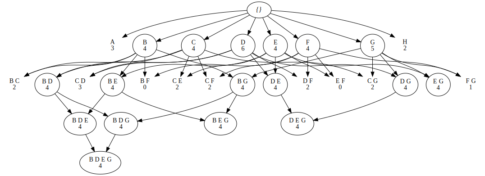
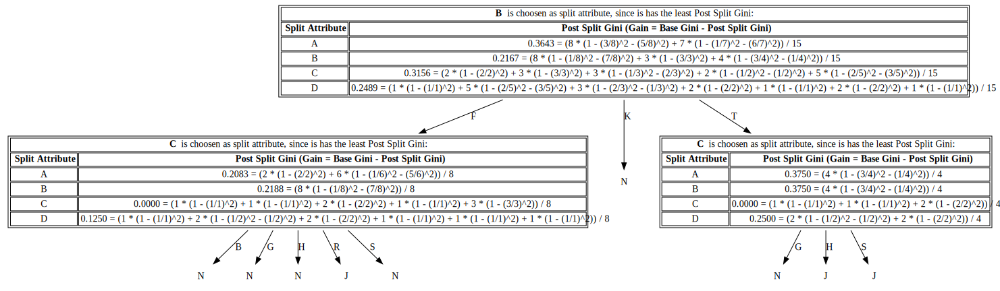
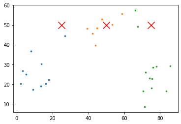
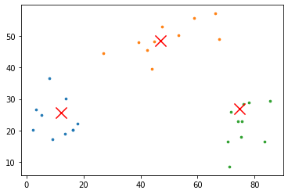
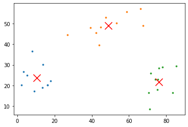
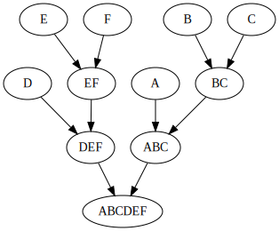
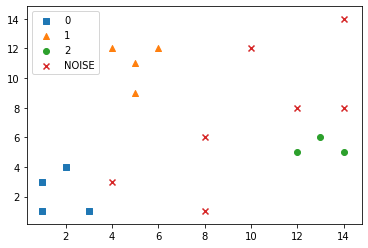

_Aksel er kul ass_

```python
%%capture
import sys
!{sys.executable} -m pip install --upgrade git+https://github.com/akselbor/tdt4300.git#egg=tdt4300
```

```python
import pandas as pd
import numpy as np
from tdt4300.fp_growth import *
from tdt4300.apriori import *
from tdt4300.decision_tree import *
from tdt4300.clustering import *
```

```python
pd.set_option('display.max_colwidth', -1)
```

# Kjekt å ha

Implementations for (most of them visualized):

- **FP-Growth** (FP-tree, table showing calculations, frequent patterns)
- **Decision Tree** (including calculations at all steps)
- **Apriori** with $F_{k-1} \times F_{k-1}$ candidate generation
- **K-means**
- **Hierarchical Aggloromerative Clustering (HAC)**
- **DBSCAN**
- **Similarity measures**

```python
# Covariance and standard deviation.
cov = lambda x, y: 1 / (len(x) - 1) * sum(np.subtract(x, np.mean(x)) * np.subtract(y, np.mean(y)))
stddev = lambda x: np.sqrt(cov(x, x))

# Similarity measures
corr = lambda x, y: cov(x, y) / (stddev(x) * stddev(y))
euclidean = lambda x, y: np.linalg.norm(np.subtract(x, y))
cosine = lambda x, y: np.array(x).dot(np.array(y)) / (np.linalg.norm(x) * np.linalg.norm(y))
jaccard = lambda x, y: sum(np.logical_and(np.equal(x, 1), np.equal(y, 1)) / (sum(np.logical_or(np.not_equal(x, 0), np.not_equal(y, 0)))))
```

```python
apriori(minsup=4, transactions=[
    'ABCDEG',
    'CDFH',
    'AFG',
    'DF',
    'BDEG',
    'BDEG',
    'BCDEGH',
    'ACF'
])
```



```python
fp_tree = FPTree.build_from(minsup=2, transactions=[
        'ACE',
        'BCE',
        'BCDE',
        'CDE',
        'DE'
])

fp_tree.step_through(minsup=2)
```

<div>
<style scoped>
    .dataframe tbody tr th:only-of-type {
        vertical-align: middle;
    }

    .dataframe tbody tr th {
        vertical-align: top;
    }

    .dataframe thead th {
        text-align: right;
    }

</style>
<table border="1" class="dataframe">
  <thead>
    <tr style="text-align: right;">
      <th></th>
      <th>Item</th>
      <th>Conditional Base Pattern</th>
      <th>Conditional FP-Tree</th>
      <th>Frequent Patterns Generated</th>
    </tr>
  </thead>
  <tbody>
    <tr>
      <td>0</td>
      <td>-</td>
      <td>-</td>
      <td>-</td>
      <td>$\{B: 2\}$</td>
    </tr>
    <tr>
      <td>1</td>
      <td>$B$</td>
      <td>$\{C, E: 1\}, \{C, E, D: 1\}$</td>
      <td>$ \langle C: 2, E: 2 \rangle $</td>
      <td>$\{B, E: 2\}, \{B, E, C: 2\}, \{B, C: 2\}$</td>
    </tr>
    <tr>
      <td>2</td>
      <td>-</td>
      <td>-</td>
      <td>-</td>
      <td>$\{D: 3\}$</td>
    </tr>
    <tr>
      <td>3</td>
      <td>$D$</td>
      <td>$\{E: 1\}, \{E, C: 2\}$</td>
      <td>$ \langle E: 3, C: 2 \rangle $</td>
      <td>$\{D, C: 2\}, \{D, C, E: 2\}, \{D, E: 3\}$</td>
    </tr>
    <tr>
      <td>4</td>
      <td>-</td>
      <td>-</td>
      <td>-</td>
      <td>$\{C: 4\}$</td>
    </tr>
    <tr>
      <td>5</td>
      <td>$C$</td>
      <td>$\{E: 4\}$</td>
      <td>$ \langle E: 4 \rangle $</td>
      <td>$\{C, E: 4\}$</td>
    </tr>
    <tr>
      <td>6</td>
      <td>-</td>
      <td>-</td>
      <td>-</td>
      <td>$\{E: 5\}$</td>
    </tr>
    <tr>
      <td>7</td>
      <td>$E$</td>
      <td>-</td>
      <td>-</td>
      <td>-</td>
    </tr>
  </tbody>
</table>
</div>

```python
decision_tree(
    # Meta stuff. The first one is whether or not to show detailed calculations,
    # whereas the second one is which metric to use (either gini or entropy as of now).
    show_calculations=True,
    metric = gini,
    # Here's the actual data.
    header=['A', 'B', 'C', 'D', 'Class'],
    samples=np.array([
        ['L', 'F', 'R', '2', 'J'],
        ['H', 'T', 'S', '4', 'J'],
        ['H', 'T', 'S', '4', 'J'],
        ['L', 'F', 'S', '2', 'N'],
        ['H', 'F', 'G', '5', 'N'],
        ['H', 'T', 'G', '2', 'N'],
        ['L', 'F', 'S', '6', 'N'],
        ['H', 'K', 'G', '4', 'N'],
        ['H', 'T', 'H', '2', 'J'],
        ['H', 'F', 'S', '5', 'N'],
        ['H', 'K', 'B', '7', 'N'],
        ['L', 'F', 'B', '9', 'N'],
        ['L', 'K', 'R', '2', 'N'],
        ['L', 'F', 'H', '1', 'N'],
        ['L', 'F', 'H', '7', 'N'],
    ]),
)
```



```python
# One really long line so the data itself doesn't take up *too* much space. It's only to show example usage
data = np.array([[66.24345364, 57.31053969], [43.88243586, 39.69929645], [44.71828248, 48.38791398], [39.27031378, 48.07972823], [58.65407629, 55.66884721], [26.98461303, 44.50054366], [67.44811764, 49.13785896], [42.38793099, 45.61070791], [53.19039096, 50.21106873], [47.50629625, 52.91407607], [2.29566576, 20.15837474], [18.01306597, 22.22272531], [16.31113504, 20.1897911 ], [13.51746037, 19.08356051], [16.30599164, 20.30127708], [5.21390499, 24.91134781], [9.13976842, 17.17882756], [3.44961396, 26.64090988], [8.12478344, 36.61861524], [13.71248827, 30.19430912], [74.04082224, 23.0017032 ], [70.56185518, 16.47750154], [71.26420853, 8.57481802], [83.46227301, 16.50657278], [75.25403877, 17.91105767], [71.81502177, 25.86623191], [75.95457742, 28.38983414], [85.50127568, 29.31102081], [75.60079476, 22.85587325], [78.08601555, 28.85141164]])
centroids = np.array([[25, 50],[50, 50],[75, 50]])

# Note: this does not show the very final table, since it is simply equal to the second to last
# (since y'know, iteration stops when we don't encounter any change)
data, centroids  = kmeans(data, centroids, iterations=-1)
silhouette_score(data, centroids)
```







    0.6752214860168544

```python
# Label: Coordinate
table = { 'A': (4, 3), 'B': (5, 8), 'C': (5, 7), 'D': (9, 3), 'E': (11, 6), 'F': (13, 8) }

# maxlink is also available
hac(table, minlink, print_progress=True)
```

    Merging (B, C)
    Merging (E, F)
    Merging (D, EF)
    Merging (A, BC)
    Merging (DEF, ABC)



```python
points = np.array([(1, 1), (14, 8), (6, 12), (3, 1), (5, 11), (13, 6), (4, 12), (12, 8), (1, 3), (8, 1), (5, 9), (10, 12), (14, 5), (2, 4), (8, 6), (4, 3), (12, 5), (14, 14),])

# dbscan_labels(points, eps=2.0, min_pts=3) # NOISE, BORDER or CORE for each point.
dbscan(points, eps=2.0, min_pts=3)
```

    Noise: P_2, P_8, P_10, P_12, P_15, P_16, P_18

<div>
<style scoped>
    .dataframe tbody tr th:only-of-type {
        vertical-align: middle;
    }

    .dataframe tbody tr th {
        vertical-align: top;
    }

    .dataframe thead th {
        text-align: right;
    }

</style>
<table border="1" class="dataframe">
  <thead>
    <tr style="text-align: right;">
      <th></th>
      <th>Group</th>
    </tr>
  </thead>
  <tbody>
    <tr>
      <td>0</td>
      <td>{$P_{1}$, $P_{4}$, $P_{9}$, $P_{14}$}</td>
    </tr>
    <tr>
      <td>1</td>
      <td>{$P_{3}$, $P_{5}$, $P_{7}$, $P_{11}$}</td>
    </tr>
    <tr>
      <td>2</td>
      <td>{$P_{6}$, $P_{13}$, $P_{17}$}</td>
    </tr>
  </tbody>
</table>
</div>


